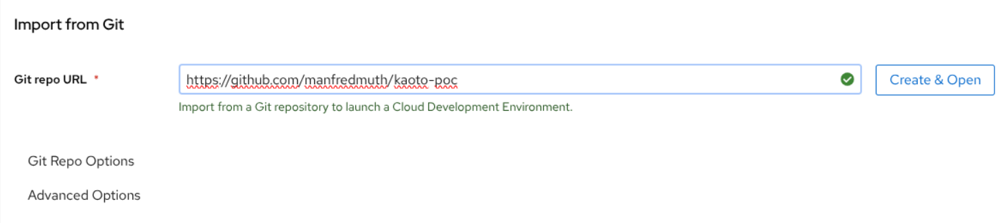
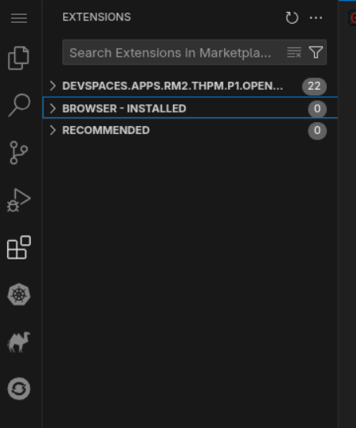

# kaoto example

This example initially used developer workspaces to show how easy you can get kaoto VSCode extensions up and running by using OpenShift DevSpaces.

- [Red Hat Developer sandbox](https://developers.redhat.com/products/openshift-dev-spaces/overview)
- Once you started a workspace you want to use the [GIT repo for kaoto](https://github.com/manfredmuth/kaoto-poc)



What happens now is that the che cluster - base of DevSpace - will deploy a DevSpace and it will use the `devfile.yaml` which is in the root directory of the GIT repo.

---

In the devfile you will find an entry which looks like:
```
commands:
  - id: post-start-install-extensions
    exec:
      label: "Install Apache Camel and Kaoto extensions"
      component: vscode
      commandLine: >
        code --install-extension redhat.apache-camel-extension-pack &&
        code --install-extension redhat.vscode-kaoto
      workingDir: /projects
```

And this will take care that the relevant VSCode extensions are installed once the IDE is started. Be patient it will take a second. And be aware that thes extensions are curated. This way a kaoto operator on the OpenShift cluster is not needed

Once the extensions are installed you will see those in the sidebar of your IDE



---

